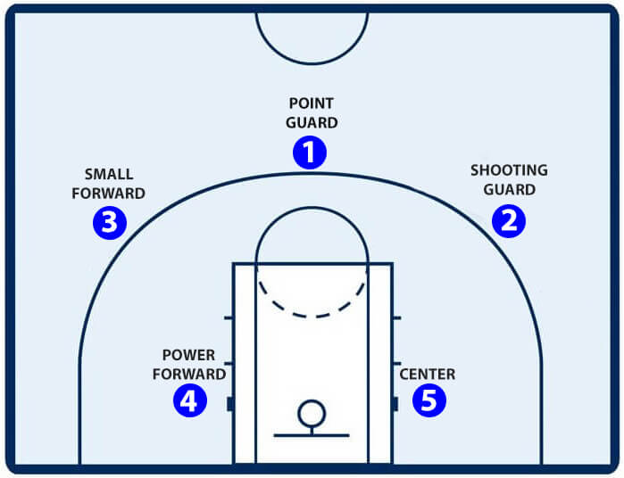
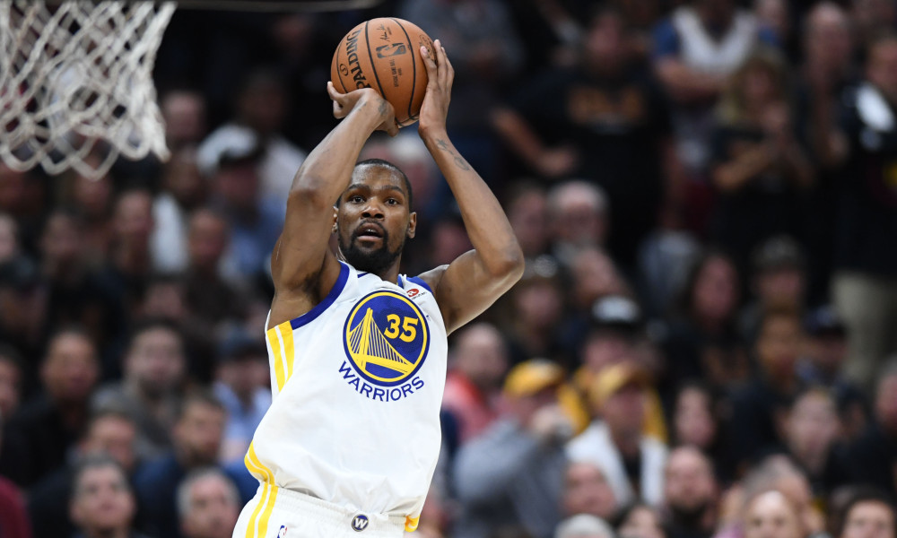
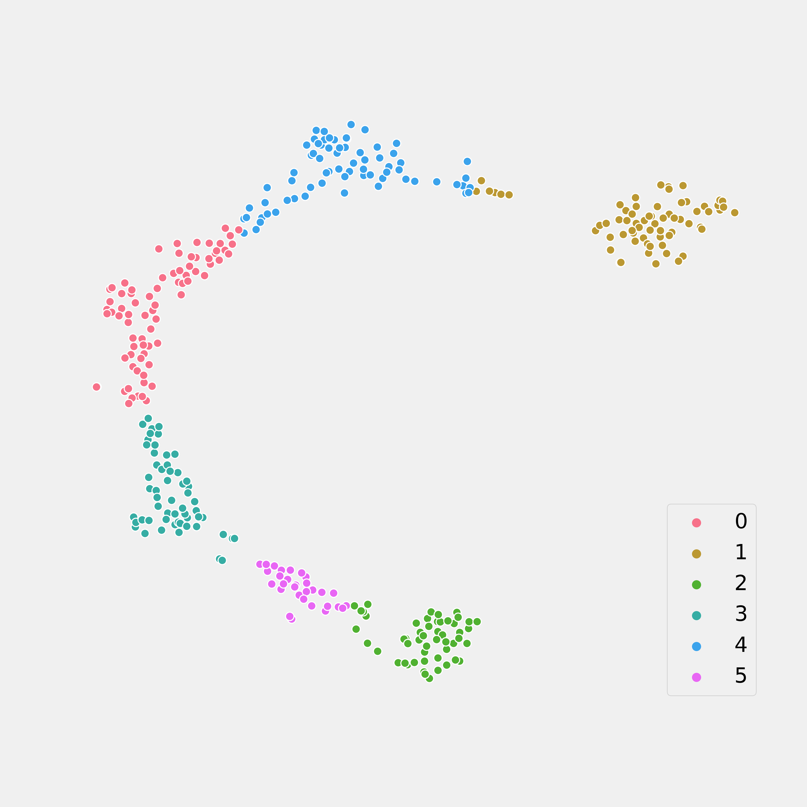
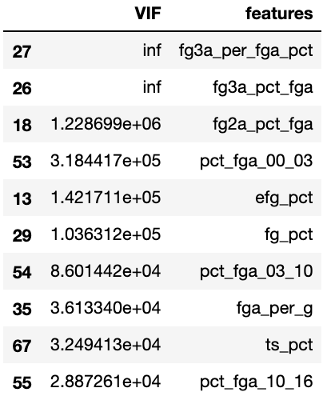
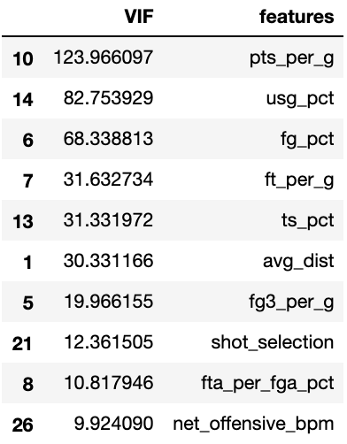
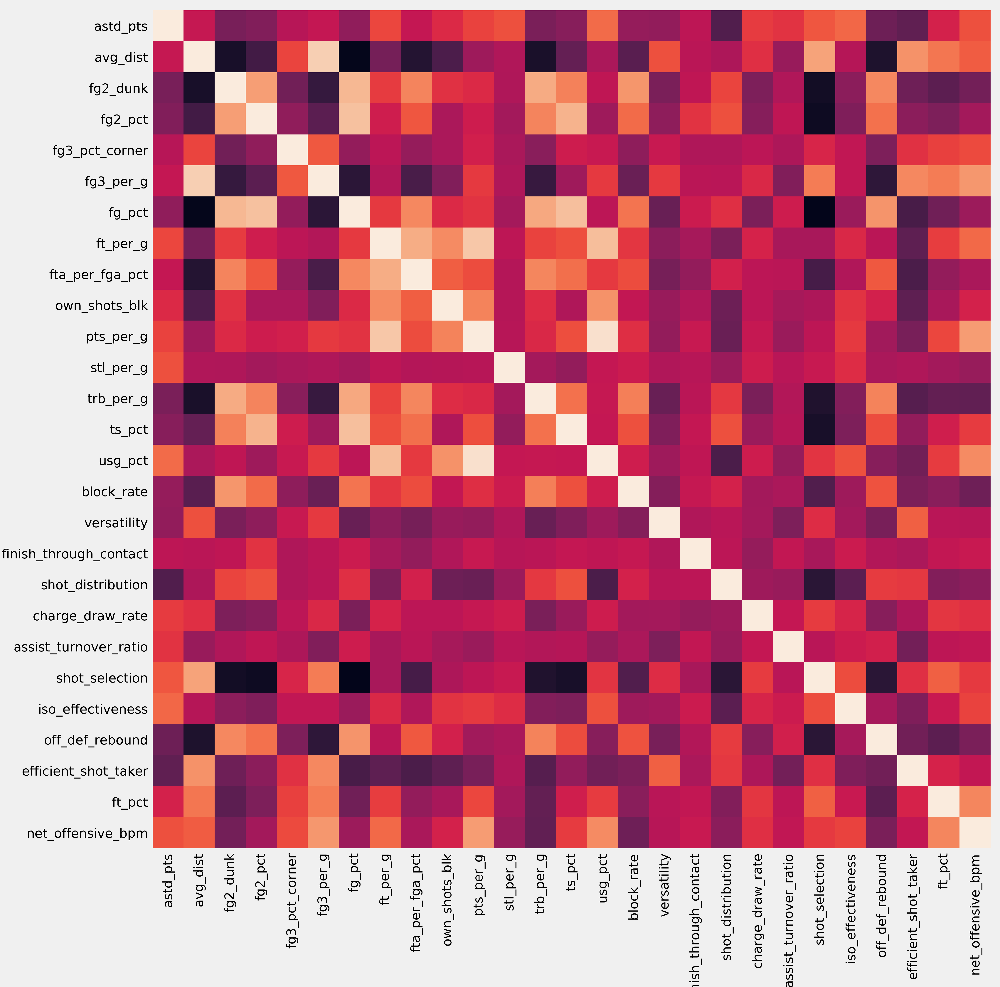
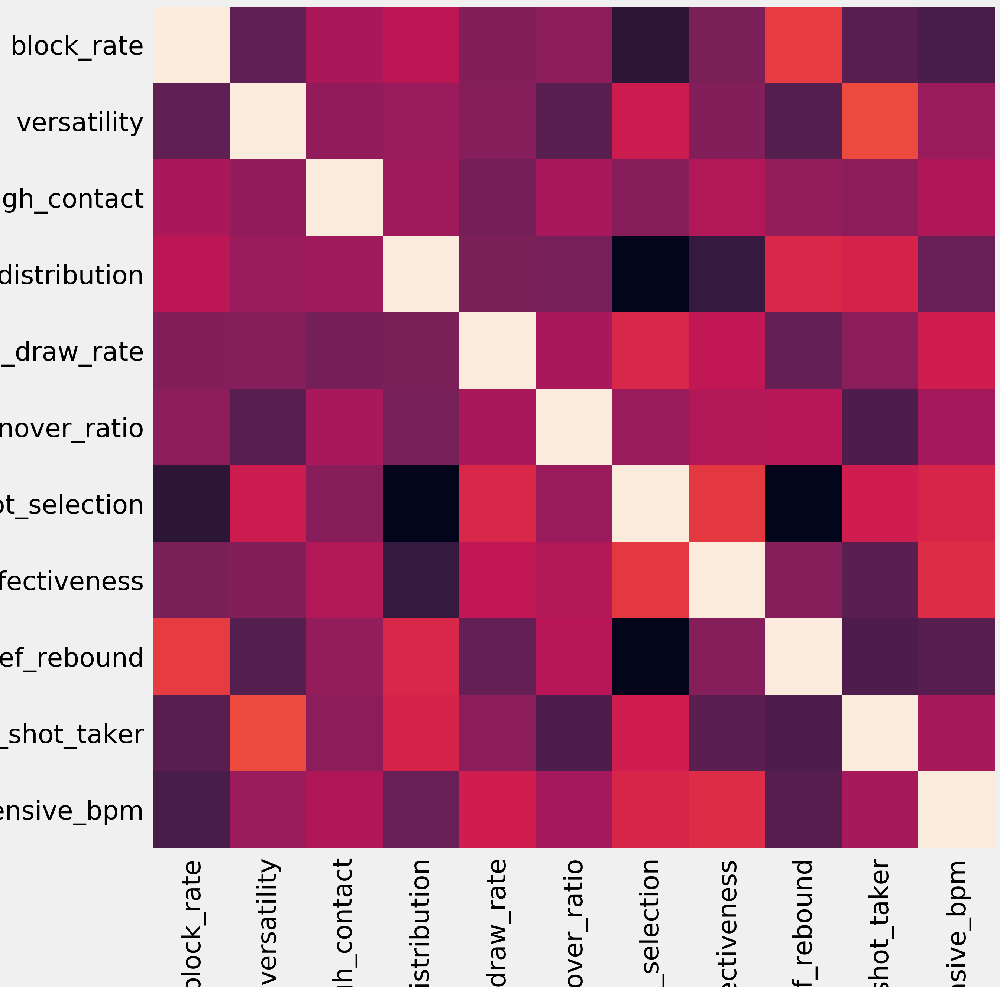

# Clustering NBA Players through Unsupervised Learning
### Identifying player types and developing new metrics for evaluating professional basketball players.

Remy Shea, May 2019
https://github.com/RemShea/nba-player-clustering

# Motivation
In recent years, the NBA has seen a meteoric rise in popularity, particularly in the last two decades or so where the leagues revenue tripled from 2.66 billion USD in the 2000-01 season, to an annual revenue of [8 billion USD in the 2017-18 season](https://www.statista.com/topics/967/national-basketball-association/). Game 5 of the 2017-18 NBA finals drew an astounding 50.6 million viewers. As the NBA has grown over the years, so too has the game of basketball and those who play it. NBA basketball has five official positions; Point Guard, Shooting Guard, Small Forward, Power Forward and Center. Each team must have one player at each position on the floor at all times.

For a long time, this method of categorizing players served as a useful, and mostly accurate heuristic to help people understand the game of basketball. The five positions of basketball have acted as a lens through which decisions of team composition and strategy have been viewed, however, a relatively recent shift in the way basketball is being played has begun to blur the lines that separate these positions more than ever. The average NBA team attempted 29.8 3-pt shots in the 2017-18 season dwarfing the 2007-08 season figure of 18.04.

A good example of the divergence between position and playstyle can be observed between 6'11" superstar Kevin Durant, who does not play basketball in the same way that 6'11" Blake Griffin might, even though they both spent the majority of their minutes at the Power Forward position this year. In light of this, there is a clear need for the definition of new player positions and metrics by which to measure player tendencies, both to aide the understanding of viewers and inform the conversation around team composition and game-planning.

# Goal
To identify clusters of similar NBA players by their style of play through machine learning techniques, as well as to develop meaningful, interpretable metrics in order to inform the discussion around the constructing of rosters and building of game plans.

# Methods

### Clustering & Unsupervised Learning
Unsupervised learning, the process of finding patterns and relationships in the data without a specific eye towards a target feature to either predict or classify, was used to separate the players into classes. K-means clustering is one such unsupervised learning technique.

K-means clustering attempts to identify a specified amount of distinct groups in the dataset by randomly allocating 'centroids' to coordinates within the feature space. Each observation is then assigned to the cluster of its nearest centroid. After this, the centroid's position is updated with the average location of each point in the centroid's cluster, and data points are once again assigned to the cluster of the nearest centroid, as the process repeats.

### Visualization using PCA & t-SNE
When datasets go beyond three or four features, it becomes very difficult for the human brain to visualize the relationships between data points in distance measures. Principal component analysis is a dimensionality reduction technique that, among other things, allows higher dimensional data to be visualized in lower dimensions. In English, this means that we can boil down large and complex data sets to a few key features that allow us to visually recognize the separation between groups. The drawback is that interpretability of these new features is mostly out the window.

Another approach is called t-distributed stochastic neighbor embedding, pronounced 'tee-snee' (like in sneeze). This approach also has interpretability issues but typically does a better job of visualizing in lower dimensions than a PCA. Essentially, it scatters the data points onto a low-dimensional ,easily visualizable space, like an area or a line, and allowing the members of it's own class pull, and the others push, that point in a given direction on that low-dimensional space, determined by the distance of that datapoint to surrounding data points in the higher dimensional space.

### Feature Selection and Curse of Dimensionality
The NBA today has 30 teams, 15 in each conference. Each team is limited to a roster of 15 players at any one time. As such, the total number of people to meet the selection criteria for this analysis (played in more than 10 games and 500 minutes) is very limited. The original scraped dataset from [basketball-reference.com](https://www.basketball-reference.com/) for NBA players in the 2018-19 season contained 450 players and 81 features. A pair-wise correlation heat map shows that there is a lot of collinearity in this relatively massive feature-set; warmer colours indicate higher correlation.

Of these, only 354 NBA players met the selection criteria. The general heuristic is that a data set should have no more than the square root of the number of observations in features. Our 354 player dataset then should have at maximum around 18 features. It was immediately obvious that the number of dimensions of the data vastly exceeded an appropriate amount for the number of data points available, and drastic steps towards feature selection may be necessary. The reason for this is that, with enough features, even massive datasets can become too sparse. This is the essence of the 'Curse of Dimensionality'. The approach to addressing this is discussed below, in the feature-engineering section.

### Feature Engineering and the Variance Inflation Factor
Many of the features originally gathered were highly collinear. Points-per-game is highly correlated with field-goals-per-game, for example. The need to produce features that were both relatively independent of one another whilst remaining interpretable and still capture the majority of the variance was clear. Like the pair-wise correlation, the variance inflation factor (VIF) correlates with the other features in the feature-set. It is, more specifically, a measure of how well a given feature or stat can be predicted given all the other features in the dataset, and serves as a metric of evaluating which features needlessly complicate the dataset.

Particular care was taken in the selection and engineering of features to avoid stats which had strong components of team performance, team composition, individual skill or talent, etc. The idea behind this is that we would like to determine the given archetype a player might fit into, whilst controlling for the effects that being on a better team, or playing with better players might have. Ultimately, the goal was to isolate the decision making and tendencies of individual players, as this is where the current role definitions and statistics fall short.

After some extensive feature engineering, the 81 dimensions in which our data originally existed were reduced to 27 features, shown below and to the left. The mean pairwise correlation of the raw data was 0.0861, with a standard deviation of 0.0877. Through feature engineering, this was reduced to a mean of 0.0682 and a standard deviation of 0.0831. The hand-crafted features, shown below and on the right, reduced these figures further to 0.0608 and 0.043 respectively.

# Discussion of Results & Limitations
On the whole, the silhouette score for most analyses was rather poor after feature engineering. One possible reason for this is that by removing some features in an attempt to reduce multicollinearity, a portion of the variance captured by those variables was not explained by either the remaining features or engineered features.

Additionally, it is possible that the feature space is still too sparse, given the small nature of the dataset. It is worth considering the idea that basketball players are very multidimensional, and that the variance in their actions and play-styles is poorly captured in the 82 game regular season. By adjusting for minutes played, it is likely that a lot of additional variance is introduced when a player who plays relatively few minutes has their stats normalized to 36 minutes a game. Given that many teams realistically only play about 8 players any significant minutes every game, applying even more stringent limitations on players included in the analysis could improve results. This may also help to explain the steep drop-off seen in silhouette score when the analysis removes other overall efficacy statistics like box plus-minus, Value Over Replacement Player and Player Efficiency Rating.

Although the analysis produced mediocre clustering, what has been demonstrated throughout the course of this project is the ability to develop easily interpretable, non-collinear measures of basketball player performance.

# Next steps
### Data Sources
Although basketball-reference.com is a great resource for fans and basketball-analytics junkies, there is a limit to the granularity of the data available on that site. Other sites like https://stats.nba.com have more information that can help analysts paint however, the plain web-scraping techniques used in this analysis were not able to access any of that information, which would likely require a Selenium WebDriver-like solution, and is high on the priority list for improving this project.

Another major limitation in this project was the size of the dataset. Perhaps more, and more useful information could be gleamed by looking at the past few years of the NBA. Assuming trends in player behaviour are relatively stable over at least the last few years (not necessarily a safe assumption, as mentioned above), we could easily triple the size of our dataset and populate the feature-space with more data points.

Looking back through time also allows us to examine trends in player positions over time, which is also a very valuable insight, allowing players to up-skill themselves for the modern NBA.

### Methods
Auto-encoder neural networks are another dimensionality reduction technique that is perhaps a more modern approach to this problem. Activations of the encoding layer perform similar functions as the eigenvalues in a principal component analysis. Auto-encoder neural nets have the added benefit of being able to capture non-linearity in the dataset.

### New Uses
One interesting thing that could be done with the findings in this project is some sort of transfer learning between clustering players, team composition based on the newly identified positions and potentially predicting performance in coming seasons. Much in the same vein, clustering-enabled identification of new player types is a player recommendation system based on the role each player fulfills in the new player archetype paradigm.

Another enticing use of the findings is in scouting of basketball prospects. Drawing comparisons between up-and-coming prospects and established stars gives teams additional information when deciding who they want to develop, who they want to trade or trade for, and who they may want to draft.

Finally, one benefit of establishing clusters of players based on player type is the ability to identify players who don't fit into any category. Identifying whether a player is either a 'unicorn' or 'dodo', could be very beneficial for game-planning.

# References

# Libraries

# Data Dictionary
